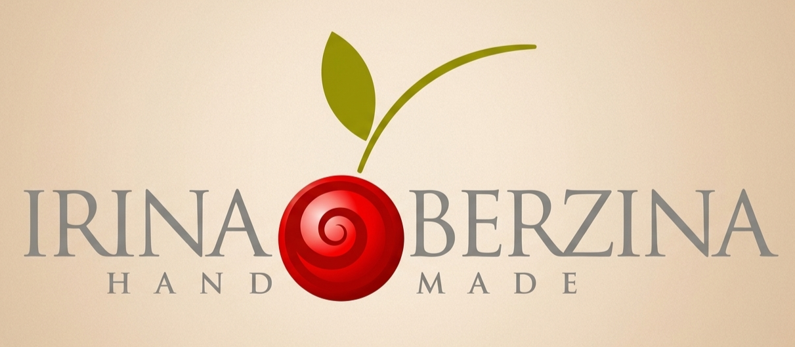

<p align="center">
  
</p>

<h1 align="center">🧵 Школа кожевенного мастерства Ирины Берзиной</h1>

<p align="center">
  <b>Премиальный лендинг для онлайн-школы по работе с кожей</b><br/>
  <i>Сшейте брендовую сумку за 14 дней — без страха испортить материал</i>
</p>

<p align="center">
  
  
  
  
</p>

---

## 📋 О проекте

Лендинг-сайт для **Школы кожевенного мастерства Ирины Берзиной** — мастера с 20-летним стажем. Сайт представляет курсы по созданию изделий из кожи: от базового обучения до продвинутых техник реставрации.

Сайт разработан в **премиальном стиле** с тёплой кожаной палитрой, золотыми акцентами и плавными анимациями при скролле.

### ✨ Ключевые особенности

- 🎨 **Премиальный дизайн** — тёплая цветовая палитра (коньяк, золото, крем), шрифты Playfair Display и Inter
- 🎞️ **Анимации при скролле** — элементы плавно появляются с помощью Intersection Observer
- 📱 **Полная адаптивность** — корректное отображение на мобильных, планшетах и десктопах
- ⚡ **Высокая производительность** — Vite обеспечивает мгновенную сборку и HMR
- 🔍 **SEO-оптимизация** — мета-теги, семантическая разметка, описания

---

## 🏗️ Структура проекта

```
├── public/
│   └── images/              # Изображения (лого, фоны, курсы, мастер)
├── src/
│   ├── components/
│   │   ├── Header.tsx       # Навигация с прозрачным фоном
│   │   ├── Hero.tsx         # Главный экран с CTA
│   │   ├── Trust.tsx        # Блок доверия и преимуществ
│   │   ├── Courses.tsx      # Карточки курсов с ценами
│   │   ├── Master.tsx       # Раздел «О мастере»
│   │   ├── Reviews.tsx      # Отзывы учеников
│   │   ├── Contact.tsx      # Форма записи / контакты
│   │   └── Footer.tsx       # Подвал сайта
│   ├── App.tsx              # Корневой компонент
│   ├── hooks.ts             # Кастомный хук useInView
│   ├── index.css            # Глобальные стили и Tailwind
│   └── main.tsx             # Точка входа React
├── index.html               # HTML-шаблон
├── vite.config.ts           # Конфигурация Vite
├── tsconfig.json            # Настройки TypeScript
└── package.json             # Зависимости и скрипты
```

---

## 🚀 Быстрый старт

### Предварительные требования

- **Node.js** 18+ 
- **npm** 9+

### Установка и запуск

```bash
# 1. Клонируйте репозиторий
git clone https://github.com/VladCrim/site_video_course.git
cd site_video_course

# 2. Установите зависимости
npm install

# 3. Запустите dev-сервер
npm run dev
```

Сайт будет доступен по адресу **(https://site-video-course.vercel.app/)**

### Сборка для продакшена

```bash
npm run build
npm run preview    # Предпросмотр собранной версии
```

---

## 📚 Разделы сайта

| Раздел | Описание |
|--------|----------|
| **Hero** | Полноэкранный баннер с фоновым изображением, заголовком, статистикой и CTA-кнопками |
| **Доверие** | Преимущества школы — почему стоит выбрать именно эти курсы |
| **Курсы** | Три программы обучения с ценами, описаниями и списком навыков |
| **О мастере** | История Ирины Берзиной, награды, 20-летний опыт работы с кожей |
| **Отзывы** | Реальные отзывы учеников о прохождении курсов |
| **Контакты** | Форма записи на курс и контактная информация |

---

## 🛠️ Технологии

| Технология | Версия | Назначение |
|------------|--------|-----------|
| [React](https://react.dev/) | 19 | UI-библиотека |
| [TypeScript](https://www.typescriptlang.org/) | 5.9 | Типизация |
| [Vite](https://vite.dev/) | 7 | Сборщик и dev-сервер |
| [Tailwind CSS](https://tailwindcss.com/) | 4 | Утилитарные CSS-стили |

---

## 📄 Лицензия

Все права на контент и изображения принадлежат их авторам.

---

<p align="center">
  Сделано с ❤️ для <b>Школы кожевенного мастерства Ирины Берзиной</b>
</p>
